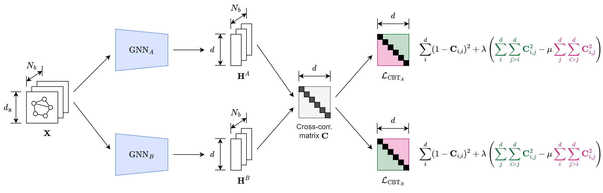

# Task-Agnostic Graph Neural Network Evaluation via Adversarial Collaboration

[Paper](https://arxiv.org/abs/2301.11517) | [Dissertation](https://victorzxy.github.io/project/graphac/MEng-Dissertation-GraphAC.pdf)

## Abstract

It has been increasingly demanding to develop reliable Graph Neural Network (GNN) evaluation methods to quantify the progress of the rapidly expanding GNN research. Existing GNN benchmarking methods focus on comparing the GNNs with respect to their performances on some node/graph classification/regression tasks in certain datasets. There lacks a principled, task-agnostic method to directly compare two GNNs. Moreover, most of the existing graph self-supervised learning (SSL) works incorporate handcrafted augmentations to the graph, which has several severe difficulties due to the unique characteristics of graph-structured data. To address the aforementioned issues, we propose GraphAC (Graph Adversarial Collaboration) – a conceptually novel, principled, task-agnostic, and stable framework for evaluating GNNs through contrastive self-supervision. GraphAC succeeds in distinguishing GNNs of different expressiveness across various aspects, and has been proven to be a principled and reliable GNN evaluation method, eliminating the need for handcrafted augmentations for stable SSL.



## How to run

### Step 1: Setup Environment

Please set up the environment using [Conda](https://docs.conda.io/projects/conda/en/stable/). Clone the current repository:

    git clone https://github.com/VictorZXY/GraphAC.git

Create a new environment with all required packages using [`environment.yml`](./environment.yml) (this can take a while). While in the project directory run:

    conda env create -f environment.yml

Activate the environment:

    conda activate GraphAC

### Step 2: Train the GraphAC Framework

A number of configuration files have been preset in `configs/model_ranking`. For example:

    python train.py --config=configs/model_ranking/hidden_dim/pna_hidden_dim_256vs128.yml
    
During pre-training a directory is created in the `runs` directory that contains the logs and the trained models. You can start TensorBoard and navigate to `localhost:6006` in your browser to monitor the training process:

    tensorboard --logdir=runs --port=6006
    
## Cite this project

```bibtex
@article{Zhao2023GraphAC,
    title = {Task-Agnostic Graph Neural Network Evaluation via Adversarial Collaboration},
    author = {Xiangyu Zhao and 
              Hannes St{\"a}rk and 
              Dominique Beaini and 
              Yiren Zhao and
              Pietro Li{\`o}},
    journal = {11th International Conference on Learning Representations (ICLR 2023) Machine Learning for Drug Discovery (MLDD) Workshop},
    year = {2023}
}
```
